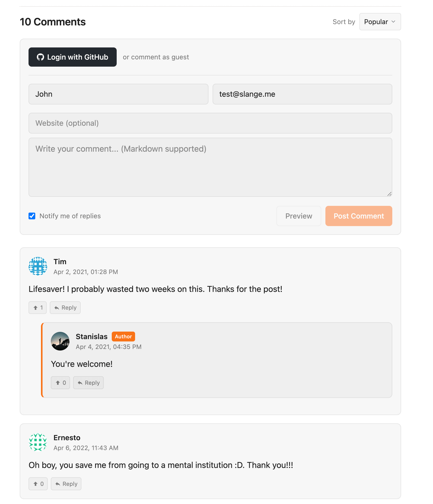
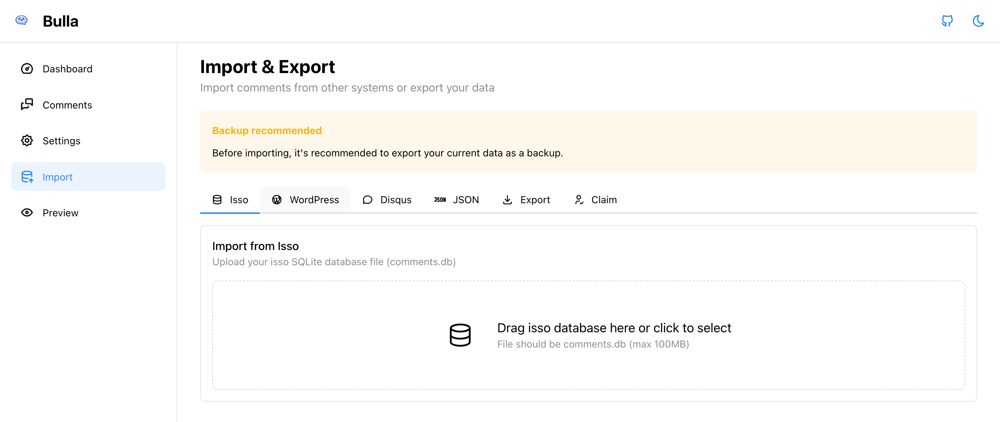
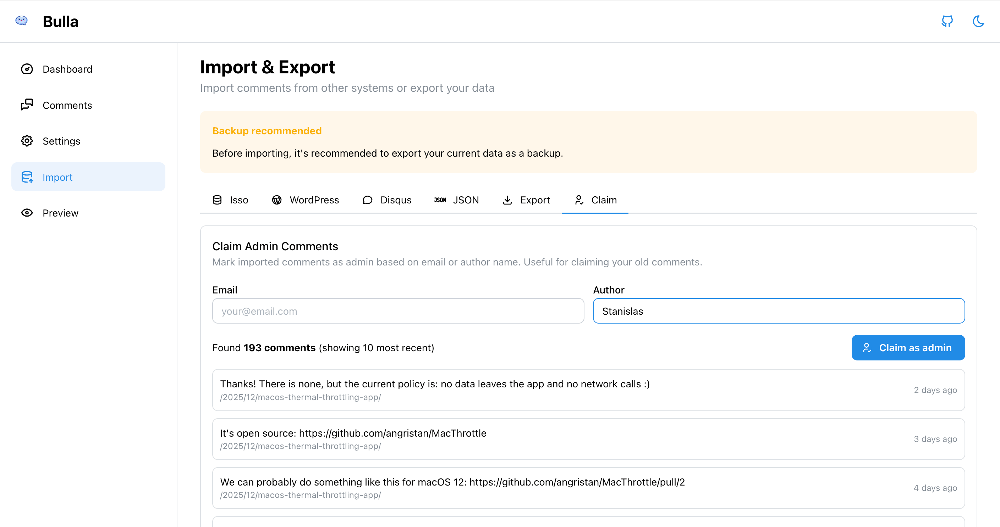
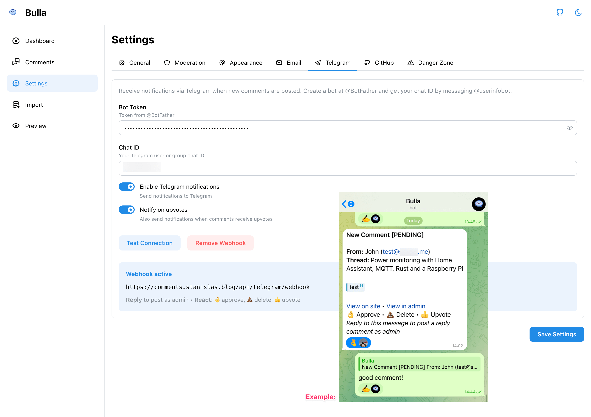

<p align="center">
  
</p>

# Bulla

A self-hosted comment system for static sites and blogs.

## Features

- **Comments**
  - Markdown support with GitHub-flavored syntax and live preview
  - Nested replies with configurable depth
  - Sorting by oldest, newest, or popular (by votes)
  - Voting with optional upvotes and downvotes
  - Editing within a configurable time window
  - Deep linking to any comment with `#comment-{id}`
- **Appearance**
  - Dark mode (light, dark, or auto)
  - Customization with accent color, custom CSS, and branding options
  - Avatars via Gravatar, GitHub, optionally proxied by imgproxy
- **Authentication**
  - Anonymous commenting with optional name/email/website
  - Optional GitHub login for commenters
  - Admin comments with badge, claim past comments by email/name
  - Two-factor authentication (TOTP) for admin login
- **Notifications**
  - Email notifications for moderation and for replies with unsubscribe support
  - Telegram bot for notifications, replies, and moderation
- **Moderation**
  - Approve, spam, delete from admin panel, email, or Telegram
  - Spam protection with honeypot, rate limiting, and blocked words
- **Data**
  - Import from isso, Disqus, or WordPress
  - Export to JSON
  - Atom feeds for comment threads
- **Self-hosting**
  - Single Docker container with SQLite (PostgreSQL optional)
  - Simple embedding with a single script tag
  - Lightweight embed (~10KB gzipped)



## Quick Start

Bulla is designed to be easily self-hosted. Just a single Docker container with SQLite. PostgreSQL and imgproxy are optional.

```bash
docker run -d \
  -p 8000:8080 \
  -v bulla_data:/app/database \
  -e APP_URL=https://comments.example.com \
  ghcr.io/angristan/bulla:latest
```

To add comments to your site:

```html
<script
    src="https://comments.example.com/embed/embed.js"
    data-bulla="https://comments.example.com"
    async
></script>
<div id="bulla-thread"></div>
```

Learn more in the [Self-Hosting Guide](docs/self-hosting.md).

## Documentation

- [Embedding Guide](docs/embedding.md)
- [API Reference](docs/api.md)

## Tech Stack

- **Backend:** Laravel 12, PHP 8.3+
- **Admin Panel:** React, Inertia.js, Mantine
- **Embed Widget:** Preact, CSS
- **Database:** SQLite (default) or PostgreSQL
- **Deployment:** Docker with FrankenPHP

## Architecture

```
┌─────────────────┐     ┌─────────────────┐
│   Your Site     │     │  Admin Panel    │
│  (embed.js)     │     │  (React/Inertia)│
└────────┬────────┘     └────────┬────────┘
         │                       │
         │ REST API              │ Inertia
         │                       │
         └───────────┬───────────┘
                     │
            ┌────────▼────────┐
            │     Laravel     │
            │   (API + Auth)  │
            └────────┬────────┘
                     │
            ┌────────▼────────┐
            │ SQLite/PostgreSQL│
            └─────────────────┘
```

- **Embed Widget** (`embed/`) - Lightweight Preact app (~10KB) injected into user sites via script tag. Communicates with the backend via REST API.
- **Admin Panel** (`resources/js/`) - React SPA using Inertia.js for server-driven routing. Manages comments, settings, and moderation.
- **Backend** (`app/`) - Laravel API handling comments, authentication, notifications, and storage.

## Development

```bash
# Clone repository
git clone https://github.com/angristan/bulla
cd bulla

# Set up environment
cp .env.example .env
php artisan key:generate
php artisan migrate

# Start development (installs deps, runs server + vite + embed watcher)
composer run dev
```

This runs concurrently:

- Laravel server (`php artisan serve`)
- Queue worker (`php artisan queue:listen`)
- Log viewer (`php artisan pail`)
- Vite for admin assets (`npm run dev`)
- Embed widget watcher (`npm run dev --prefix embed`)

## Testing

```bash
# Run all tests
php artisan test

# Run specific test suite
php artisan test tests/Feature/Comment

# With coverage
php artisan test --coverage
```

Tests run against both SQLite and PostgreSQL in CI.

## Features

### Admin


### Importing Comments

Bulla supports importing from:

- **isso** - Upload your isso SQLite database file
- **Disqus** - Export your data from Disqus and upload the XML file
- **WordPress** - Export comments via WXR (WordPress eXtended RSS) format

To import: Go to Admin > Settings > Import, select your platform, and upload the file. Comments will be imported with original timestamps preserved.



After importing, use the "Claim Admin Comments" feature in Settings to mark your past comments as admin by matching email or author name.



### Moderation

Bulla offers multiple moderation options:

- **Admin Panel:** Approve, delete, or mark comments as spam directly from the admin interface.
- **Email:** Receive moderation links in notification emails to approve, delete, or mark comments as spam without logging in.
- **Telegram Bot:** Moderate comments via Telegram commands.

### Admin moderation panel

Comments can be moderated from the admin panel. You can filter comments by status (pending, approved, spam, deleted), search by author or content, and sort. Each comment has buttons to approve, delete, or mark as spam.


A few knobs in the settings allow you to configure moderation behavior, such as enabling pre-moderation for all comments.


### Email Notifications

Bulla can send email notifications for new comments and replies. Notification emails include direct links to moderate (approve, delete, mark as spam) comments without logging into the admin panel. For guests, unsubscribe links are provided.


### Telegram bot

One of my favorite features is the Telegram bot integration. It allows you to receive notifications for new comments and replies directly in Telegram. You can also moderate comments (approve, delete, mark as spam) and reply to comments right from the chat. It's very conveniant for staying on top of discussions on the go!



## Configuration

All configuration is done through the admin panel after initial setup. Key settings:

- **Moderation mode:** None or all comments
- **Edit window:** How long users can edit their comments
- **Max nesting depth:** Visual nesting level (0-3), replies unlimited
- **Rate limiting:** Comments per minute per IP
- **Blocked words:** Spam keyword list
- **Accent color:** Customize the primary color for buttons and links
- **Custom CSS:** Inject custom styles into the embed widget
- **Allowed origins:** Control which domains can embed comments
- **GitHub OAuth:** Client ID and secret for commenter authentication

## Acknowledgements

Inspired by [Isso](https://github.com/isso-comments/isso).

## License

MIT
